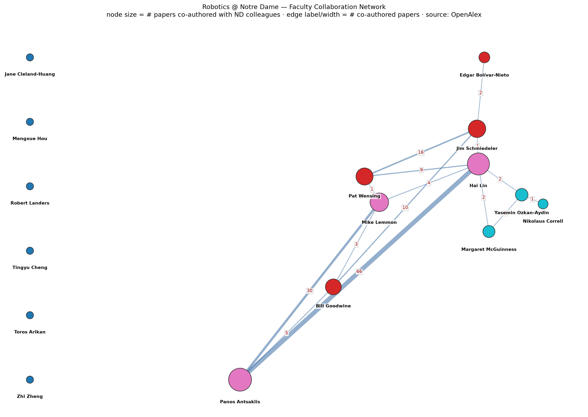

# Robotics @ Notre Dame — Faculty Collaboration Network

An interactive graph of who co-authors with whom among the
[Robotics @ Notre Dame](https://robotics.nd.edu/people/) faculty.

- **Node** = a faculty member, shown as their headshot (all the same size).
- **Edge** = the two faculty have co-authored papers; thickness and the number
  label are how many. Click an edge number to list the shared papers.
- **Color** = collaboration cluster (grey ring = no co-authorships with other ND
  robotics faculty).
- **Recent collaborations** panel lists the newest co-authored papers.

Per-faculty *publication totals are intentionally not shown*: OpenAlex
over-counts them (name over-merging). Collaboration counts, which are not
hallucinated, are what the site displays.

**Live site:** https://nd-pair.github.io/web/ — **internal page, password: `pair@nd`.**

> **Note on the password.** This is a *soft* gate: the site is a public GitHub
> Pages repo, so anyone can read `data/graph.json` directly regardless of the
> password. It keeps casual visitors out and marks the page as internal, but it
> is **not** real access control. For that, use a private repo behind a host with
> real auth (Cloudflare Access, Netlify password protection, etc.). The gate
> compares a SHA-256 hash, so the plaintext password is not in the source.



## How it works

```
robotics.nd.edu/people/   →  crawl_openalex.py  →  data/oa_profiles/*.json
                                     │
                                     ▼
                              build_site.py      →  data/graph.json  (+ assets/graph.png)
                                     │
                                     ▼
                               index.html         →  interactive D3 force graph
```

1. **`scripts/crawl_openalex.py`**
   - **Syncs the roster** from `robotics.nd.edu/people/`: every faculty card that
     links to an `*.nd.edu/faculty/<slug>/` profile is included (external
     collaborators link off-site and are skipped). Add/remove someone on the
     people page and they are added/removed here on the next run; stale profiles
     and photos are pruned. If the page can't be parsed it falls back to a
     curated list and does **not** prune (so a transient failure can't wipe the
     graph).
   - **Downloads each headshot** (`img.image-circle`) to `assets/faculty/`.
   - **Resolves** each person to an [OpenAlex](https://openalex.org) author id
     (preferring a Notre Dame affiliation and matching surname) and downloads
     every work with its co-authors and dates.
2. **`scripts/build_site.py`** turns those profiles into `data/graph.json`.
   Two faculty are linked when one's OpenAlex author id appears in the other's
   authorship list; the edge weight is the number of shared papers. Also emits
   the shared papers per edge and a `news` list (newest co-authored papers).
3. **`index.html`** loads `data/graph.json` behind the password gate and renders
   the interactive graph (headshot nodes, drag, hover, click an edge number to
   list shared papers, recent-collaborations feed).

### Why OpenAlex instead of Google Scholar?

Google Scholar has no public API and serves a CAPTCHA to automated / datacenter
traffic, so it cannot run unattended in CI. OpenAlex is an open, crawlable
scholarly graph that exposes the same co-authorship signal.
`scripts/crawl_scholar.py` keeps a Google Scholar version for **manual** runs
from a residential connection, if you want to cross-check.

## Run locally

```bash
pip install -r scripts/requirements.txt
python scripts/crawl_openalex.py     # refresh data/oa_profiles/
python scripts/build_site.py         # rebuild data/graph.json + assets/graph.png
python -m http.server 8000           # then open http://localhost:8000
```

## Automation

`.github/workflows/update.yml` runs the crawl + build and deploys to GitHub
Pages:

- **weekly** (Mondays 06:17 UTC),
- **on every push to `main`**, and
- **on demand** (Actions → *Run workflow*).

Refreshed data is committed back to the repo with the `GITHUB_TOKEN`, which by
design does **not** retrigger the workflow, so there is no loop.

### One-time setup

1. **Settings → Pages → Build and deployment → Source: GitHub Actions.**
2. (Optional) add a repo secret **`OPENALEX_MAILTO`** with a contact email to
   join OpenAlex's faster "polite pool".
3. If the repo is **private**, GitHub Pages requires a GitHub Team/Enterprise
   plan; otherwise make the repo public.

## Data notes / caveats

- Author disambiguation is automated. A few names are common: `Zhi Zheng` is
  pinned to the correct ND author via an `OVERRIDES` entry (by slug) in
  `crawl_openalex.py`; add more there if someone resolves to the wrong person.
  `SEARCH_NAME` overrides the OpenAlex query for a slug when needed.
- Very common names (e.g. `Hai Lin`) can map to an over-merged OpenAlex profile.
  This is exactly why publication totals are not displayed; the *co-authorship*
  links are still valid.
- `Toros Arikan` may show a previous institution until OpenAlex catches up.
- Node labels use the department's display names (e.g. "Pat Wensing",
  "Margaret McGuinness"), while OpenAlex is queried with the formal name from the
  profile slug.

Data source: [OpenAlex](https://openalex.org). Graph rendered with
[D3](https://d3js.org).
